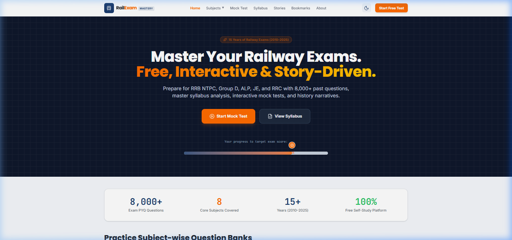
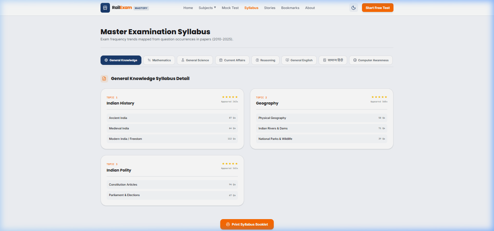
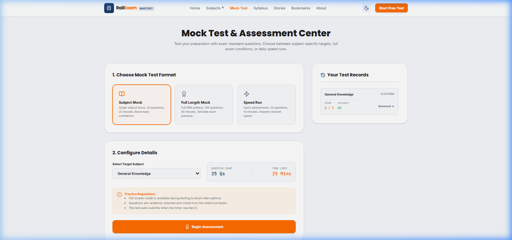
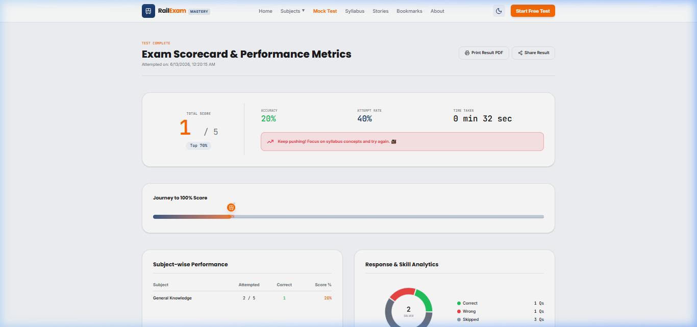

# 🚂 RailExam Mastery — Railway Exam Preparation Ecosystem

> **Scope:** Full-Stack Client-Side Web Application  
> **Target:** RRB / RRC / NTPC / Group D / ALP / JE Competitive Exams (2010–2025)  
> **Live Site:** [http://localhost:5173/](http://localhost:5173/)  
> **Repository:** [https://github.com/varuna1704/Exam-railway](https://github.com/varuna1704/Exam-railway)

---

## 🧠 Project Overview

**RailExam Mastery** is a premium self-study platform designed to help railway aspirants prepare for various recruitment board examinations. The platform functions as a completely client-side application powered by static seed data and `localStorage` persistence, offering features like interactive timed mock tests, subject breakdowns, visual performance graphs, master syllabus outlines, and concept-oriented history stories.

---

## ✨ Key Features

### 1. Subject Hubs & 4-Tab Workspace
Every subject (General Knowledge, Arithmetic, Science, Current Affairs, Reasoning, General English, Hindi, and Computer Awareness) renders a dedicated prep workspace:
- **PYQ Bank:** Practice past questions with filter controls (Year, Topic, Difficulty), full-text search, paginated cards, and expandable explanation boxes.
- **Syllabus Booklet:** Inspect topic weights based on question appearances. Includes frequency stars and print-to-PDF styles.
- **History Stories:** Read custom narratives generated to teach exam concepts in context. Exam questions are embedded directly into the text with tooltips showing where they appeared. Features a distraction-free serif **Read Mode**.
- **Quick Revision:** Practice flashcards with 3D flip card animations and session accuracy logs.

### 2. Timed Mock Test Engine
- Select from three formats: **Subject Mocks** (25 Qs / 25 min), **Full Length Mocks** (100 Qs / 90 min), and **Speed runs** (20 Qs / 10 min).
- Attempt tests inside a live portal showing countdown timers, a question navigation grid (answered, skipped, flagged), and auto-submission controls.

### 3. Detailed Results Dashboard (Scorecards)
- View scores, overall accuracy, time taken, and percentile estimations.
- Features a **Train Track Progress Bar** that maps your score to a train moving along rails to a 100% target.
- Group metrics into subject tables and interactive charts (Donut charts for answers and Radar charts for subject comparison).
- Inspect a list of weak topics containing direct links back to the matching PYQ filters.

### 4. Personal Bookmarks Library
- Save difficult questions from any subject page by clicking the heart button (♥).
- View, search, and manage bookmarks in one centralized dashboard.

---

## 🖼️ Application Screenshots

### 1. Home Dashboard
*The central hub to select subjects, view global stats, and access quick tools.*


### 2. Interactive Syllabus & Print Outlines
*Syllabus viewer with frequency stars and print-to-PDF generation capabilities.*


### 3. Timed Mock Test Engine
*A live simulation of railway examinations with timer, navigations, and controls.*


### 4. Detailed Results Scorecard
*Detailed analytics, Recharts visualization, and train track progression animation.*



---

## 🛠️ Technology Stack & Dependencies

- **Frontend core:** React 19 + TypeScript + Vite
- **Routing:** React Router DOM v7
- **Styling:** Tailwind CSS v4 (configured via `@theme` variables inside `src/index.css`) + PostCSS
- **Visualizations:** Recharts (responsive Pie & Radar charts)
- **Effects:** Canvas Confetti & Framer Motion
- **Icons:** Lucide React

---

## 📁 Codebase Architecture

```
railway-exam/
├── src/
│   ├── assets/             # Images, SVGs, and base logo assets
│   ├── components/         # Reusable global UI elements
│   │   ├── Footer.tsx      # Page footer and disclaimers
│   │   ├── Navbar.tsx      # Desktop headers + Mobile bottom drawers
│   │   ├── ThemeToggle.tsx # Dark/Light theme toggles
│   │   └── TrainProgressBar.tsx # Signature SVG progress bar
│   ├── data/
│   │   └── questionSeeds.ts# Seed database (questions, stories, and syllabi)
│   ├── pages/              # Main view screens
│   │   ├── Home.tsx        # Hero search, statistics, and subject cards
│   │   ├── SubjectDetail.tsx   # 4-tab revision workspace
│   │   ├── MockTestHub.tsx     # Exam setup panel and test histories
│   │   ├── LiveMockTest.tsx    # Live countdown test engine
│   │   ├── Scorecard.tsx       # Recharts graphs and weak topic analysis
│   │   ├── Bookmarks.tsx       # Personal bookmark revision
│   │   └── About.tsx           # Platform info and government disclaimers
│   ├── types/
│   │   └── index.ts        # TypeScript schemas and models
│   ├── App.tsx             # Route manager and layout switcher
│   ├── index.css           # Tailwind v4 theme, fonts, and print styles
│   └── main.tsx            # Root loader
├── postcss.config.js
├── tailwind.config.js
├── tsconfig.json
└── vite.config.ts
```

---

## 🚀 Quick Start Guide

### 1. Install Dependencies
Clone the repository and run:
```bash
npm install
```

### 2. Run Locally in Development Mode
Start Vite's development server:
```bash
npm run dev
```
Open **[http://localhost:5173](http://localhost:5173)** in your browser.

### 3. Build for Production
Verify typescript compilation and generate static bundles in `dist/`:
```bash
npm run build
```

---

## ⚖️ Legal Disclaimer

This platform is an independent study resource. Questions are compiled from publicly available previous year papers and memory-based recollections. This site is not affiliated with the Railway Recruitment Board (RRB), Railway Recruitment Cell (RRC), or the Ministry of Railways, Government of India.
